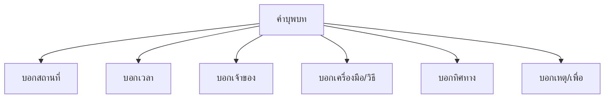

# คำบุพบท

> บุพบทบอกสถานที่ เวลา ความเป็นเจ้าของ เครื่องมือ — เชื่อมคำนามกับคำอื่น

**คำบุพบท** (Preposition) คือ คำที่วางหน้าคำนามเพื่อแสดงความสัมพันธ์ระหว่างคำนามกับคำอื่นในประโยค

---

## เนื้อหาตามช่วงชั้น

| ช่วงชั้น | เนื้อหา |
|---|---|
| **ป.4–6** | รู้จักบุพบทพื้นฐาน |
| **ม.1–3** | จำแนกประเภทบุพบท |

---

## ประเภทของคำบุพบท

---

## 1. บุพบทบอกสถานที่

| บุพบท | ตัวอย่าง |
|---|---|
| ที่ | ที่โรงเรียน |
| ใน | ในห้อง |
| นอก | นอกบ้าน |
| บน | บนโต๊ะ |
| ใต้ | ใต้ต้นไม้ |
| ข้าง | ข้างบ้าน |
| ระหว่าง | ระหว่างต้นไม้ |
| ตรง | ตรงประตู |
| รอบ | รอบบ้าน |

---

## 2. บุพบทบอกเวลา

| บุพบท | ตัวอย่าง |
|---|---|
| เมื่อ | เมื่อวาน |
| ตอน | ตอนเช้า |
| ก่อน | ก่อนเที่ยง |
| หลัง | หลังเลิกเรียน |
| ระหว่าง | ระหว่างเรียน |
| ใน | ในเวลา 3 โมง |
| ตั้งแต่ | ตั้งแต่เช้า |

---

## 3. บุพบทบอกเจ้าของ

| บุพบท | ตัวอย่าง |
|---|---|
| ของ | หนังสือของฉัน |
| แห่ง | นักเรียนแห่งโรงเรียนนี้ |

---

## 4. บุพบทบอกเครื่องมือ/วิธี

| บุพบท | ตัวอย่าง |
|---|---|
| ด้วย | ตัดด้วยมีด |
| โดย | เดินทางโดยรถ |
| อาศัย | อาศัยเพื่อนช่วย |

---

## 5. บุพบทบอกทิศทาง

| บุพบท | ตัวอย่าง |
|---|---|
| ไป | ไปโรงเรียน |
| มา | มาบ้าน |
| สู่ | สู่จุดหมาย |
| ถึง | ถึงปลายทาง |
| จาก | จากบ้าน |

---

## 6. บุพบทบอกเหตุ/เพื่อ

| บุพบท | ตัวอย่าง |
|---|---|
| เพราะ | เพราะฝนตก |
| เพื่อ | เพื่อน้อง |
| เนื่องจาก | เนื่องจากฝน |
| แทน | แทนเพื่อน |

---

## คำบุพบทที่ใช้บ่อย

| บุพบท | หน้าที่ | ตัวอย่าง |
|---|---|---|
| ของ | เจ้าของ | ปากกาของครู |
| ใน | สถานที่/เวลา | ในกล่อง / ในวันจันทร์ |
| ที่ | สถานที่/เวลา | ที่โรงเรียน / ที่ 3 โมง |
| ด้วย | เครื่องมือ | เขียนด้วยดินสอ |
| โดย | วิธีการ | โดยรถบัส |
| จาก | จุดเริ่มต้น | จากบ้านถึงโรงเรียน |
| เพื่อ | จุดประสงค์ | เพื่อสุขภาพ |
| เพราะ | เหตุผล | เพราะป่วย |

---

## เคล็ดลับการใช้คำบุพบท

1. **จำหน้าที่**: แต่ละบุพบทมีหน้าที่เฉพาะ
2. **วางหน้านาม**: บุพบท + นาม = วลีบุพบท
3. **เลือกคำให้ถูก**: แต่ละสถานการณ์ใช้คำต่างกัน
4. **ไม่ใช้ซ้ำซ้อน**: เช่น "จากที่" เมื่อ "จาก" ก็พอ

---

## ดูเพิ่มเติม

- [[07_คำวิเศษณ์|คำวิเศษณ์]]
- [[09_คำสันธาน|คำสันธาน]]
