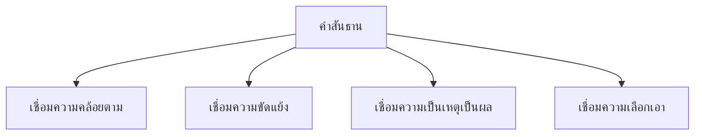

# คำสันธาน

> สันธานเชื่อมความคล้อยตาม ขัดแย้ง เป็นเหตุเป็นผล เลือกเอา — เชื่อมประโยคและข้อความ

**คำสันธาน** (Conjunction) คือ คำที่ใช้เชื่อมคำ วลี หรือประโยค เข้าด้วยกัน ทำให้ข้อความต่อเนื่องและสัมพันธ์กัน

---

## เนื้อหาตามช่วงชั้น

| ช่วงชั้น | เนื้อหา |
|---|---|
| **ป.4–6** | สันธานพื้นฐาน: และ หรือ แต่ |
| **ม.1–3** | จำแนกประเภทสันธาน |

---

## ประเภทของคำสันธาน



---

## 1. สันธานเชื่อมความคล้อยตาม

เชื่อมข้อความที่ไปในทางเดียวกัน เพิ่มเติม

| สันธาน | ตัวอย่าง |
|---|---|
| และ | สมชายและสมหญิง |
| และก็ | เขากินและก็นอน |
| รวมทั้ง | รวมทั้งเพื่อนๆ |
| ตลอดจน | ตลอดจนครู |
| อีก | อีกทั้ง |
| ทั้ง...ทั้ง | ทั้งสวยทั้งฉลาด |

---

## 2. สันธานเชื่อมความขัดแย้ง

เชื่อมข้อความที่ขัดแย้งกัน

| สันธาน | ตัวอย่าง |
|---|---|
| แต่ | สวยแต่ไม่ฉลาด |
| แต่ว่า | แต่ว่าเขาไม่มา |
| แม้...ก็ | แม้ฝนตกก็ไป |
| ถึง...ก็ | ถึงจะเหนื่อยก็ทำ |
| อย่างไรก็ตาม | อย่างไรก็ตาม เขายังมา |
| แม้นว่า | แม้นว่ายากก็ทำ |
| มิเพียงแต่ | มิเพียงแต่...ยัง |

---

## 3. สันธานเชื่อมความเป็นเหตุเป็นผล

เชื่อมข้อความที่เป็นเหตุและผล

| สันธาน | ตัวอย่าง |
|---|---|
| เพราะ | ไม่มาเพราะป่วย |
| เพราะว่า | เพราะว่าฝนตก |
| เนื่องจาก | เนื่องจากฝนตก |
| เพราะฉะนั้น | เพราะฉะนั้นจึงไม่มา |
| ดังนั้น | ดังนั้นเราต้องระวัง |
| ฉะนั้น | ฉะนั้นต้องรีบ |
| เพราะเหตุนั้น | เพราะเหตุนั้นจึงเกิด |
| ก็เพราะ | ก็เพราะเขาขยัน |

---

## 4. สันธานเชื่อมความเลือกเอา

เชื่อมข้อความที่เลือกอย่างใดอย่างหนึ่ง

| สันธาน | ตัวอย่าง |
|---|---|
| หรือ | ชาหรือกาแฟ |
| หรือว่า | หรือว่าจะไป |
| ไม่...ก็ | ไม่ไปก็อยู่ |
| อย่างใดอย่างหนึ่ง | อย่างใดอย่างหนึ่ง |

---

## การใช้สันธานในประโยค

### การเชื่อมคำ

```
คำ + สันธาน + คำ
สมชาย และ สมหญิง → เชื่อมคำนาม 2 คำ
กิน หรือ ดื่ม → เชื่อมกริยา 2 คำ
```

### การเชื่อมวลี

```
วลี + สันธาน + วลี
ไปตลาด และ ซื้อของ → เชื่อมวลี 2 วลี
```

### การเชื่อมประโยค

```
ประโยค + สันธาน + ประโยค
ฝนตกหนัก เพราะฉะนั้นเราจึงไม่ไป
```

---

## เคล็ดลับการใช้คำสันธาน

1. **เลือกสันธานให้ถูกประเภท**: คล้อยตาม/ขัดแย้ง/เหตุผล/เลือก
2. **ไม่ใช้มากเกิน**: ประโยคเดียวไม่ควรมีสันธานเยอะเกินไป
3. **ใช้คำเชื่อมให้ตรงกับความหมาย**: และ ≠ แต่
4. **ระดับภาษา**: ทางการใช้ "เนื่องจาก" กันเองใช้ "เพราะ"

---

## ดูเพิ่มเติม

- [[08_คำบุพบท|คำบุพบท]]
- [[10_คำอุทาน|คำอุทาน]]
- [[13_ประโยคในภาษาไทย|ประโยคในภาษาไทย]]
