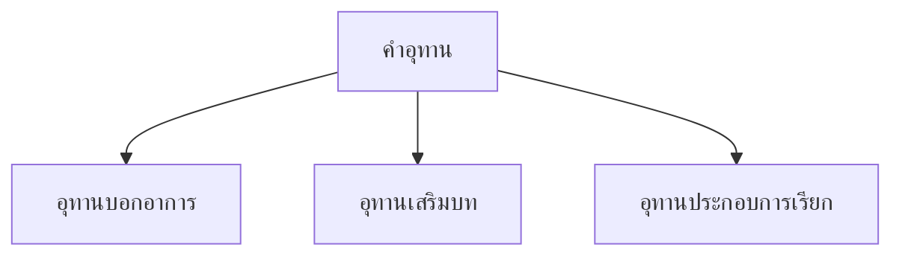

# คำอุทาน

> อุทานบอกอาการ อุทานเสริมบท อุทานประกอบการเรียก — แสดงอารมณ์และความรู้สึง

**คำอุทาน** (Interjection) คือ คำที่แสดงความรู้สึก อารมณ์ หรือการเรียก มักใช้เดี่ยวๆ ไม่เกี่ยวข้องกับโครงสร้างประโยค

---

## เนื้อหาตามช่วงชั้น

| ช่วงชั้น | เนื้อหา |
|---|---|
| **ป.4–6** | คำอุทานพื้นฐาน |
| **ม.1–3** | จำแนกประเภทอุทาน |

---

## ประเภทของคำอุทาน



---

## 1. อุทานบอกอาการ

แสดงอารมณ์ ความรู้สึง ตกใจ ดีใจ เสียใจ

| คำอุทาน | แสดง | ตัวอย่าง |
|---|---|---|
| โอ๊ย! | เจ็บ | โอ๊ย! เจ็บจัง |
| โอ้! | ตื่นเต้น | โอ้! สวยจัง |
| อุ้ย! | ตกใจ | อุ้ย! ตกใจ |
| โอ้โฮ! | ประหลาดใจ | โอ้โฮ! ใหญ่จัง |
| โอ้พระเจ้า! | ตื่นเต้นมาก | โอ้พระเจ้า! ไม่จริง |
| เฮ้อ! | เหนื่อย/เสียใจ | เฮ้อ! เหนื่อยจัง |
| โอ๊ะ! | สงสัย | โอ๊ะ! อะไรนั่น |
| อ่า! | เข้าใจแล้ว | อ่า! เข้าใจแล้ว |

---

## 2. อุทานเสริมบท

คำที่ใช้เสริมความหมายในประโยค ทำให้น่าสนใจ

| คำอุทาน | ความหมาย | ตัวอย่าง |
|---|---|---|
| นั่นไง | นั่นเอง | นั่นไง บอกแล้ว |
| นะ | เน้น | ระวังนะ |
| สิ | เน้นกริยา | ไปสิ |
| ด้วย | เพิ่มเติม | ฉันด้วย |
| เลย | อย่างยิ่ง | ดีเลย |
| น่า | ชักชวน | ไปน่า |
| กระมัง | สงสัย | คงจะมากระมัง |

---

## 3. อุทานประกอบการเรียก

คำที่ใช้เรียกหรือทักทาย

| คำอุทาน | ใช้เรียก | ตัวอย่าง |
|---|---|---|
| เฮ้ย! | เรียกเพื่อน | เฮ้ย! มานี่ |
| ว่าไง | ทักทาย | ว่าไง เป็นไงบ้าง |
| เฮ้! | เรียกสนใจ | เฮ้! ฟังนี่ |
| โอ | ทักทาย | โอ มาแล้ว |
| เอ้า | เชิญ/เรียก | เอ้า เข้ามา |
| นี่ | เรียก | นี่ ฟังนี่ |

---

## เครื่องหมายอัศเจรีย์

คำอุทานมักใช้กับเครื่องหมายอัศเจรีย์ (!) เพื่อแสดงอารมณ์

```
โอ๊ย! เจ็บ!
ว้าย! ตกใจ!
โอ้โฮ! สวยจัง!
```

---

## เคล็ดลับการใช้คำอุทาน

1. **ใช้ตามอารมณ์**: ตื่นเต้น ดีใจ เสียใจ
2. **ใช้เครื่องหมาย !**: เพื่อเน้นความรู้สึก
3. **ไม่ใช้มากเกิน**: ในงานเขียนทางการ
4. **เหมาะสมกับกาลเทศะ**: ภาษาพูด > ภาษาเขียน

---

## ดูเพิ่มเติม

- [[09_คำสันธาน|คำสันธาน]]
- [[15_ระดับภาษา|ระดับภาษา]]
