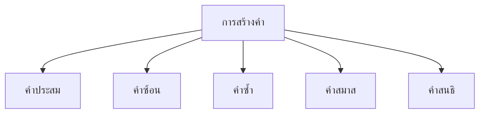

# การสร้างคำแบบต่างๆ

> คำประสม คำซ้อน คำซ้ำ คำสมาส คำสนธิ — วิธีที่ภาษาไทยสร้างคำใหม่

**การสร้างคำ** คือ กระบวนการที่ภาษาไทยใช้ในการสร้างคำใหม่จากคำเดิม โดยมีวิธีการหลายแบบ ทั้งการประสม การซ้อน การซ้ำ การสมาส และการสนธิ

---

## เนื้อหาตามช่วงชั้น

| ช่วงชั้น | เนื้อหา |
|---|---|
| **ป.4–6** | คำประสม คำซ้ำ |
| **ม.1–3** | คำซ้อน คำสมาส คำสนธิ |
| **ม.4–6** | วิเคราะห์การสร้างคำ |

---

## ประเภทการสร้างคำ

---

## 1. คำประสม

**คำประสม** คือ คำที่เกิดจากการนำคำ 2 คำขึ้นไปมาเรียงต่อกัน โดยแต่ละคำยังคงมีเสียงและความหมายเดิม

| คำประสม | มาจาก | ความหมาย |
|---|---|---|
| บ้านเรือน | บ้าน + เรือน | ที่อยู่อาศัย |
| หัวใจ | หัว + ใจ | อวัยวะในอก |
| ข้าวปลา | ข้าว + ปลา | อาหารการกิน |
| รถยนต์ | รถ + ยนต์ | ยานพาหนะ |
| หนังสือพิมพ์ | หนังสือ + พิมพ์ | สื่อสิ่งพิมพ์ |
| โรงเรียน | โรง + เรียน | สถานศึกษา |

**ลักษณะ:** แต่ละคำยังคงรูปและเสียงเดิม ไม่มีการเปลี่ยนแปลง

---

## 2. คำซ้อน

**คำซ้อน** คือ คำที่เกิดจากการนำคำ 2 คำที่มีความหมายอย่างเดียวกันหรือใกล้เคียงกันมาซ้อนทับกัน

| คำซ้อน | มาจาก | ความหมาย |
|---|---|---|
| ใหญ่โต | ใหญ่ + โต | มีขนาดใหญ่ |
| งดงาม | งด + งาม | มีความสวย |
| สูงศักดิ์ | สูง + ศักดิ์ | มีฐานะสูง |
| มั่งคั่ง | มั่ง + คั่ง | มีทรัพย์มาก |
| อุดมสมบูรณ์ | อุดม + สมบูรณ์ | มีอย่างพอเพียง |
| สง่าราศี | สง่า + ราศี | มีความงามสง่า |

**ลักษณะ:** คำทั้งสองมีความหมายเหมือนหรือใกล้เคียงกัน การซ้อนทำให้ความหมายหนักแน่นขึ้น

---

## 3. คำซ้ำ (Reduplication)

**คำซ้ำ** คือ คำที่เกิดจากการพูดคำเดิมซ้ำ เพื่อเปลี่ยนความหมายหรือเน้นความหมาย

### ประเภทคำซ้ำ

| ประเภท | รูปแบบ | ตัวอย่าง | ความหมาย |
|---|---|---|---|
| **คำซ้ำแบบเต็ม** | ก → ก-ก | คน-คน | ทุกคน |
| **คำซ้ำแบบเปลี่ยนเสียง** | ก → ก-ข | จาง-หวาน | หวาน |
| **คำซ้ำบอกความหมาย "ทุก"** | ก → ก-ก | วัน-วัน | ทุกวัน |
| **คำซ้ำบอกความหมาย "เน้น"** | ก → ก-ก | เร็ว-เร็ว | เร็วมาก |

### คำซ้ำที่ใช้ ๆ

| คำซ้ำ | ความหมาย | การใช้ |
|---|---|---|
| คนละ | แยกกัน | คนละอย่าง |
| น้อยนิด | น้อยมาก | น้อยนิด |
| เบาหวิว | เบามาก | เบาหวิว |
| ขาวโพลน | ขาวมาก | ขาวโพลน |
| เด็กๆ | เด็กทุกคน | เด็กๆ ชอบเล่น |

---

## 4. คำสมาส (Compound via Pali/Sanskrit)

**คำสมาส** คือ คำที่เกิดจากการนำคำบาลีหรือสันสกฤต 2 คำมารวมกัน โดย **ไม่มีการเปลี่ยนรูป** ของคำ

| คำสมาส | มาจาก | ความหมาย |
|---|---|---|
| พุทธศาสนา | พุทธ + ศาสนา | ศาสนาของพระพุทธเจ้า |
| ชาตกาล | ชาติ + กาล | เวลาเกิด |
| น้ำนม | น้ำ + นม | ของเหลวจากเต้านม |
| ทรัพย์สิน | ทรัพย์ + สิน | สมบัติ |
| จิตใจ | จิต + ใจ | ความ รู้สึกนึกคิด |

**ลักษณะ:** คำทั้งสองมาจากบาลี/สันสกฤต นำมารวมกันโดยตรง

---

## 5. คำสนธิ (Sandhi)

**คำสนธิ** คือ คำที่เกิดจากการนำคำบาลีหรือสันสกฤต 2 คำมารวมกัน โดย **มีการเปลี่ยนรูป** ของคำ (เสียงสุดท้ายของคำแรกเปลี่ยนไป)

| คำสนธิ | มาจาก | การเปลี่ยนแปลง |
|---|---|---|
| ราชาธิราช | ราชา + อธิราช | า → าธิ |
| วิทยาลัย | วิทยา + อาลัย | า → าล |
| ภาษาไทย | ภาษา + ไทย | ไม่เปลี่ยน |
| มหาวิทยาลัย | มหา + วิทยาลัย | การประสม |
| ศรี | ศ + รี | ศ + รี → ศรี |

---

## ตารางเปรียบเทียบการสร้างคำ

| ประเภท | แหล่งที่มา | มีการเปลี่ยนรูป? | ตัวอย่าง |
|---|---|---|---|
| คำประสม | คำไทย + คำไทย | ไม่ | บ้านเรือน |
| คำซ้อน | คำไทย + คำไทย (พ้องความหมาย) | ไม่ | ใหญ่โต |
| คำซ้ำ | คำไทยเดียวกัน | ไม่ | คน-คน |
| คำสมาส | บาลี/สันสกฤต | ไม่ | พุทธศาสนา |
| คำสนธิ | บาลี/สันสกฤต | **ใช่** | ราชาธิราช |

---

## เคล็ดลับการสร้างและวิเคราะห์คำ

1. **ดูว่าคำเป็นไทยแท้หรือยืม**: ไทยแท้ = ประสม/ซ้อน/ซ้ำ
2. **ดูว่ามีการเปลี่ยนรูปหรือไม่**: เปลี่ยน = สนธิ, ไม่เปลี่ยน = สมาส
3. **ดูความหมาย**: พ้องความหมาย = ซ้อน, เหมือนกัน = ประสม
4. **ใช้พจนานุกรม**: เมื่อสงสัยว่าเป็นสมาสหรือสนธิ

---

## ดูเพิ่มเติม

- [[12_คำยืมจากภาษาต่างประเทศ|คำยืมจากภาษาต่างประเทศ]]
- [[04_คำนาม|คำนาม]]
