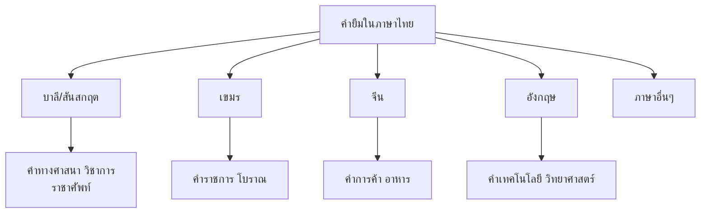

# คำยืมจากภาษาต่างประเทศ

> คำยืมจากภาษาบาลี สันสกฤต เขมร จีน อังกฤษ — ภาษาไทยรับเอาคำจากหลายวัฒนธรรม

**คำยืม** (Loanword) คือ คำที่ภาษาไทยรับเอามาจากภาษาอื่น แล้วปรับเสียงให้เข้ากับระบบเสียงของภาษาไทย คำยืมทำให้ภาษาไทยมีความหลากหลายแ

---

## เนื้อหาตามช่วงชั้น

| ช่วงชั้น | เนื้อหา |
|---|---|
| **ม.1–3** | รู้จักคำยืมจากภาษาต่างประเทศ |
| **ม.4–6** | วิเคราะห์ที่มาของคำยืม |

---

## ภาษาที่เป็นแหล่งของคำยืม

---

## 1. คำยืมจากภาษาบาลีและสันสกฤต

ภาษาบาลีและสันสกฤตเป็นภาษาที่ใช้ในพระพุทธศาสนาและศาสตร์ต่างๆ คำยืมส่วนใหญ่เป็นคำทางศาสนา ปรัชญา และวิชาการ

| คำยืม | ภาษาต้นทาง | ความหมาย |
|---|---|---|
| ธรรมะ | บาลี (dhamma) | คำสอน |
| วิทยา | สันสกฤต (vidyā) | ความรู้ |
| มหา | สันสกฤต (mahā) | ใหญ่ |
| ศาสนา | สันสกฤต (śāsana) | คำสอน |
| ราชา | สันสกฤต (rājā) | กษัตริย์ |
| วิทยาศาสตร์ | สันสกฤต | ความรู้เป็นเหตุเป็นผล |
| สมาธิ | บาลี (samādhi) | ตั้งมั่น |
| กรรม | บาลี (kamma) | การกระทำ |
| ภพ | บาลี (bhava) | ความเป็น |
| วัตถุ | สันสกฤต (vastu) | สิ่งของ |

---

## 2. คำยืมจากภาษาเขมร

ภาษาเขมรเป็นภาษาที่มีอิทธิพลต่อภาษาไทยมาก เนื่องจากประวัติศาสตร์อันยาวนาน คำยืมจากเขมรส่วนใหญ่เป็นคำราชการและคำโบราณ

| คำยืม | ภาษาเขมร (เขมร-ไทย) | ความหมาย |
|---|---|---|
| ปทาน | padān | คำราชการ |
| ขันธ์ | khanḍa | ส่วน |
| ปริญญา | pariññā | ความรู้ |
| อาสนะ | āsana | ที่นั่ง |
| ปัจจัง | patcam | ที่ 5 |
| มิตร | mitt | เพื่อน |
| สหาย | sahāya | เพื่อน |
| ประเทศ | pradēś | ดินแดน |
| ประชากร | prajā | ราษฎร |
| ศักดิ์ศรี | sakkhāra | เกียรติ |

---

## 3. คำยืมจากภาษาจีน

คำยืมจากจีนส่วนใหญ่เป็นคำที่เกี่ยวกับการค้า อาหาร และชีวิตประจำวัน

| คำยืม | ภาษาจีน | ความหมาย |
|---|---|---|
| เต้าหู้ | 豆腐 (dòufu) | ผลิตภัณฑ์ถั่ว |
| ซีอิ๊ว | 醬油 (jiàngyóu) | น้ำมันถั่ว |
| ก๋วยเตี๋ยว | 粿條 (kuétiáo) | เส้น |
| โชคลาภ | 好運 (hǎoyùn) | โชคดี |
| เก๋า | 老 (lǎo) | เก่า |
| ซุ้ม | 拱 (gǒng) | ซุ้มประตู |
| ง่า | ระบายน้ำ | — |

---

## 4. คำยืมจากภาษาอังกฤษ

คำยืมจากอังกฤษเป็นคำเกี่ยวกับเทคโนโลยี วิทยาศาสตร์ และโลกสมัยใหม่

| คำยืม | ภาษาอังกฤษ | ความหมาย |
|---|---|---|
| เฟอร์นิเจอร์ | furniture | เครื่องเรือน |
| คอมพิวเตอร์ | computer | เครื่องคิดเลข |
| โทรทัศน์ | television | เครื่องรับโทรทัศน์ |
| ประชาธิปไตย | democracy | ปกครองโดยประชาชน |
| เทคโนโลยี | technology | วิทยาการ |
| วิทยุ | radio | เครื่องสื่อสาร |
| แก๊ส | gas | ก๊าซ |
| โรงแรม | hotel | ที่พัก |
| บัตร | card | บัตร |
| เสื้อ | shirt | เครื่องแบบ |

---

## การปรับเสียงคำยืม

ภาษาไทยปรับเสียงคำยืมเพื่อให้เข้ากับระบบเสียงของไทย:

| กระบวนการ | ตัวอย่าง |
|---|---|
| **เปลี่ยนเสียง** | f → ฝ/ฟ (food → ฟู้ด) |
| **เปลี่ยนเสียง** | v → ว (video → วิดีโอ) |
| **เปลี่ยนเสียง** | ch → ช (cheese → ชีส) |
| **เปลี่ยนเสียง** | sh → ซ/ช (shirt → เชิ้ร์ต) |
| **เปลี่ยนเสียง** | -tion → -ชัน (information → อินฟอร์เมชัน) |

---

## เคล็ดลับการใช้คำยืม

1. **เขียนให้ถูกต้อง**: ตามที่ราชบัณฑิตยสถานกำหนด
2. **เลือกคำไทยแท้เมื่อทำได้**: เช่น คอมพิวเตอร์ → เครื่องคอมพิวเตอร์
3. **รู้จักที่มา**: บาลี/สันสกฤต/เขมร/จีน/อังกฤษ
4. **ใช้พจนานุกรม**: เมื่อสงสัย

---

## ดูเพิ่มเติม

- [[11_การสร้างคำแบบต่างๆ|การสร้างคำแบบต่างๆ]]
- [[15_ระดับภาษา|ระดับภาษา]]
- [[18_ภาษากับวัฒนธรรม|ภาษากับวัฒนธรรม]]
