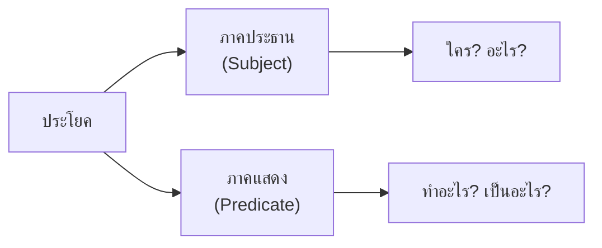
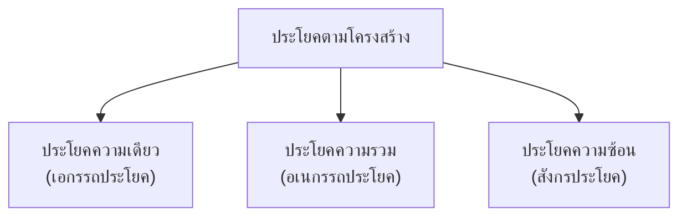

# ประโยคในภาษาไทย

> ประโยคความเดียว (เอกรรถประโยค) ประโยคความรวม (อเนกรรถประโยค) ประโยคความซ้อน (สังกรประโยค)

**ประโยค** (Sentence) คือ กลุ่มคำที่มีความหมายสมบูรณ์ ประกอบด้วยภาคประธานและภาคแสดง การจำแนกประโยคตามโครงสร้างช่วยให้เข้าใจความ สัมพันธ์ของข้อความ

---

## เนื้อหาตามช่วงชั้น

| ช่วงชั้น | เนื้อหา |
|---|---|
| **ป.1–3** | ประโยคพื้นฐาน |
| **ป.4–6** | ประโยคความเดียว |
| **ม.1–3** | ประโยคความรวม ความซ้อน |
| **ม.4–6** | วิเคราะห์โครงสร้างประโยค |

---

## โครงสร้างพื้นฐานของประโยค

**ตัวอย่าง:**
> **นักเรียน** (ประธาน) **อ่านหนังสือ** (ภาคแสดง)

---

## ประเภทประโยคตามโครงสร้าง

---

## 1. ประโยคความเดียว (เอกรรถประโยค)

**ประโยคความเดียว** คือ ประโยคที่มีประธานและภาคแสดง **อย่างละ ๑ ชุด**

| ตัวอย่าง | ประธาน | ภาคแสดง |
|---|---|---|
| **เด็กน้อยร้องไห้** | เด็กน้อย | ร้องไห้ |
| **ฝนตกหนัก** | ฝน | ตกหนัก |
| **นกบินไป** | นก | บินไป |
| **ครูสอนหนังสือ** | ครู | สอนหนังสือ |
| **แม่ทำอาหาร** | แม่ | ทำอาหาร |

---

## 2. ประโยคความรวม (อเนกรรถประโยค)

**ประโยคความรวม** คือ ประโยคที่มีประธานหรือภาคแสดงมากกว่า ๑ ชุด แต่เชื่อมด้วยสันธาน

### ประธานรวม

| ตัวอย่าง | ประธาน 1 | ประธาน 2 | ภาคแสดง |
|---|---|---|---|
| **สมชายและสมหญิงไปตลาด** | สมชาย | สมหญิง | ไปตลาด |
| **พ่อและแม่ทำงาน** | พ่อ | แม่ | ทำงาน |

### ภาคแสดงรวม

| ตัวอยาง | ประธาน | ภาคแสดง 1 | ภาคแสดง 2 |
|---|---|---|---|
| **เด็กกินข้าวและดูโทรทัศน์** | เด็ก | กินข้าว | ดูโทรทัศน์ |
| **นักเรียนเขียนหนังสือและทำการบ้าน** | นักเรียน | เขียนหนังสือ | ทำการบ้าน |

### ประธานและภาคแสดงรวม

| ตัวอย่าง |
|---|
| **สมชายกินข้าว สมหญิงดูโทรทัศน์** |
| **พ่อทำงาน แม่ทำกับข้าว** |

---

## 3. ประโยคความซ้อน (สังกรประโยค)

**ประโยคความซ้อน** คือ ประโยคที่มีประโยคย่อย (clause) ฝังอยู่ภายในประโยคหลัก โดยประโยคย่อยทำหน้าที่เป็นส่วนขยายประธาน กรรม หรือวลีบุพบท

### ประโยคย่อยขยายประธาน

| ตัวอย่าง | ประโยคย่อย |
|---|---|
| **คนที่ขยันจะสำเร็จ** | "ที่ขยัน" ขยาย "คน" |
| **เด็กที่สอบได้ที่ ๑ ได้รับรางวัล** | "ที่สอบได้ที่ ๑" ขยาย "เด็ก" |

### ประโยคย่อยขยายกรรม

| ตัวอย่าง | ประโยคย่อย |
|---|---|
| **ฉันรู้จักคนที่ขับรถมา** | "ที่ขับรถมา" ขยาย "คน" |
| **เขาซื้อหนังสือที่ฉันแนะนำ** | "ที่ฉันแนะนำ" ขยาย "หนังสือ" |

### ประโยคย่อยขยายวลีบุพบท

| ตัวอย่าง | ประโยคย่อย |
|---|วามนั้น | "ที่ฝนตกหนัก" ขยายบุพบท "ในวันที่" |
| **เขาไปในสถานที่ที่ไม่มีใครรู้** | "ที่ไม่มีใครรู้" ขยาย "สถานที่" |

---

## ประเภทประโยคตามความหมาย

| ประเภท | หน้าที่ | ตัวอย่าง |
|---|---|---|
| **ประโยคบอกเล่า** | บอกข้อเท็จจริง | ฝนตก |
| **ประโยคคำสั่ง** | สั่ง ขอร้อง | ไปทำการบ้าน |
| **ประโยคปฏิเสธ** | ปฏิเสธ | ฝนไม่ตก |
| **ประโยคคำถาม** | ถาม | ฝนตกไหม? |
| **ประโยคอุทาน** | แสดงอารมณ์ | ฝนตกหนักจัง! |
| **ประโยคแสดงความปรารถนา** | อธิษฐาน | ขอให้ฝนตก |

---

## เคล็ดลับการวิเคราะห์ประโยค

1. **หาประธาน**: ใคร? อะไร?
2. **หาภาคแสดง**: ทำอะไร? เป็นอะไร?
3. **นับชุดประธาน/ภาคแสดง**: ๑ ชุด = ความเดียว, ๒+ = ความรวม
4. **หาประโยคย่อย**: มีข้อความซ้อนหรือไม่

---

## ดูเพิ่มเติม

- [[14_การวิเคราะห์ประโยค|การวิเคราะห์ประโยค]]
- [[06_คำกริยา|คำกริยา]]
- [[09_คำสันธาน|คำสันธาน]]
