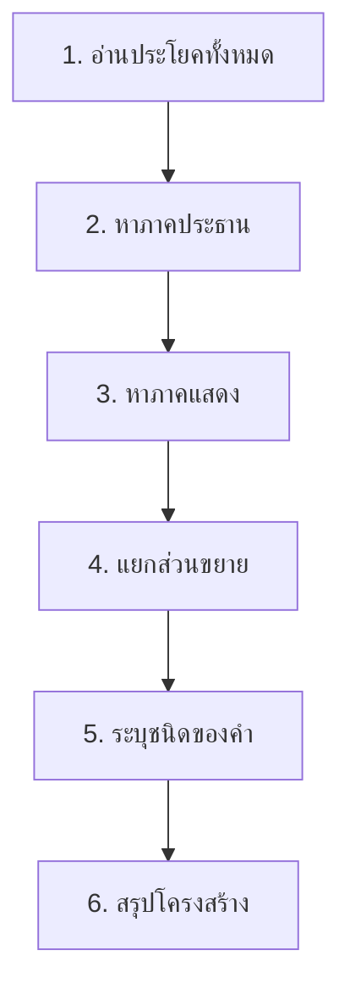
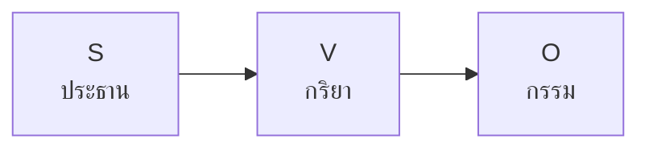

# การวิเคราะห์ประโยค

> ภาคประธาน ภาคแสดง การใช้คำเชื่อม การเรียงคำในประโยค

**การวิเคราะห์ประโยค** คือ การแยกส่วนประกอบของประโยคออกเป็นส่วนต่างๆ เพื่อเข้าใจโครงสร้างและความหมายอย่างลึกซึ้ง การวิเคราะห์ประโยคเป็นทักษะระดับสูงที่จำเป็นสำหรับการเข้าใจภาษาไทยอย่างแท้จริง

---

## เนื้อหาตามช่วงชั้น

| ช่วงชั้น | เนื้อหา |
|---|---|
| **ม.4–6** | วิเคราะห์ประโยคเชิงลึก |

---

## ขั้นตอนการวิเคราะห์ประโยค

---

## ภาคประธานและภาคแสดง

### ภาคประธาน (Subject)

**ภาคประธาน** คือ ส่วนที่บอกว่าข้อความนั้นเกี่ยวกับ **ใคร** หรือ **อะไร**

| คำถาม | ตัวอย่าง |
|---|---|
| ใคร? | นักเรียน (นักเรียนอ่านหนังสือ) |
| อะไร? | ฝน (ฝนตก) |
| ที่ไหน? | บ้าน (บ้านใหญ่) |

### ภาคแสดง (Predicate)

**ภาคแสดงเป็นส่วนที่บอกว่าประธาน **ทำอะไร เป็นอะไร หรือมีอะไร**

| คำถาม | ตัวอย่าง |
|---|---|
| ทำอะไร? | อ่านหนังสือ (นักเreียนอ่านหนังสือ) |
| เป็นอะไร? | เป็นครู (พ่อเปรี้ยงเป็นครู) |
| มีอะไร? | มีหนังสือ (ฉันมีหนังสือ) |
| อยู่ที่ไหน? | อยู่บนโต๊ะ (หนังสืออยู่บนโต๊ะ) |

---

## การแยกส่วนขยาย

### ส่วนขยายประธาน

| ตัวอย่าง | ส่วนขยาย | ประธาน |
|---|---|---|
| **เด็กน้อย**ร้องไห้ | เด็ก (น้อย) | เด็ก |
| **นักเรียนที่ขยัน**จะสำเร็จ | นักเรียน (ที่ขยัน) | นักเreียน |
| **หนังสือเล่มนั้น**เป็นของฉัน | หนังสือ (เล่มนั้น) | หนังสือ |

### ส่วนขยaยภาคแสดง

| ตัวอย่าง | ส่วนขยาย | ภาคแสดง |
|---|---|---|
| เขา**วิ่งเร็ว** | วิ่ง (เร็ว) | วิ่ง |
| นักเรียน**อ่านหนังสือด้วยความตั้งใจ** | อ่าน (หนังสือด้วยความตั้งใจ) | อ่าน |
| แม่**ทำอาหารในครัว** | ทำ (อาหารในครัว) | ทำ |

---

## การวิเคราะห์ตัวอย่าง

### ตัวอยาง 1: ประโยคความเดียว

> **นักเรียนขยันอ่านหนังสือในห้องสมุด**

| ส่วน | คำ | ชนิดของคำ |
|---|---|---|
| ประธาน | นักเreียน | คำนาม |
| ขยายกริยา | ขยัน | คำวิเศษณ์ |
| ภาคแสดง | อ่าน | คำกริยา |
| กรรม | หนังสือ | คำนาม |
| บุพบทวลี | ในห้องสมุด | วลีบุพบท |

### ตัวอย่าง 2: ประโยคความรวม

> **สมชายกินข้าว สมหญิงล้างจาน**

| ส่วน | คำ |
|---|---|
| ประธาน 1 | สมชาย |
| ภาคแสดง 1 | กินข้าว |
| ประธาน 2 | สมหญิง |
| ภาคแสดง 2 | ล้างจาน |

---

## การเรียงคำในประโยคไทย

ภาษาไทยใช้โครงสร้าง **SVO** (Subject-Verb-Object) เป็นหลัก

| ตัวอย่าง | S | V | O |
|---|---|---|---|
| ฉันกินข้าว | ฉัน | กิน | ข้าว |
| แมวจับหนู | แมว | จับ | หนู |
| ครูสอนหนังสือ | ครู | สอน | หนังสือ |

---

## คำเชื่อมในประโยค

| ประเภท | คำเชื่อม | ตัวอย่าง |
|---|---|---|
| **เชื่อมความคล้อยตาม** | และ รวมทั้ง | A **และ** B |
| **เชื่อมความขัดแย้ง** | แต่ อย่างไรก็ตาม | A **แต่** B |
| **เชื่อมความเป็นเหตุผล** | เพราะ เนื่องจาก | A **เพราะ** B |
| **เชื่อmความเลือกเอา** | หรือ ไม่...ก็ | A **หรือ** B |

---

## เคล็ดลับการวิเคราะห์ประโยค

1. **อ่านทั้งประโยคก่อน**: เข้าใจความหมายรวม
2. **หาประธานก่อนเสมอ**: ใคร? อะไร?
3. **หาภาคแสดง**: ทำอะไร? เป็นอะไร?
4. **แยกส่วนขยาย**: ขยายอะไร
5. **ระบุประเภทคำ**: นาม กริยา วิเศษณ์
6. **ตรวจสอบคำเชื่อม**: สันธานเชื่อมอะไร

---

## ดูเพิ่มเติม

- [[13_ประโยคในภาษาไทย|ประโยคในภาษาไทย]]
- [[09_คำสันธาน|คำสันธาน]]
