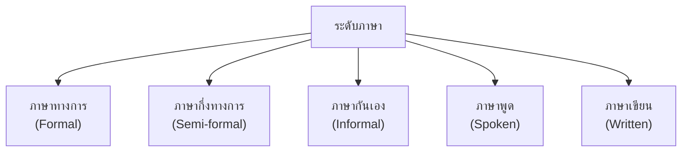
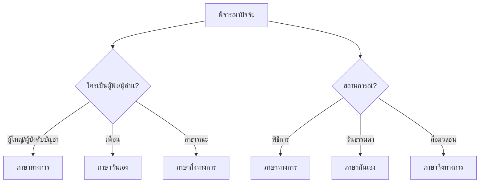

# ระดับภาษา

> ภาษาพูด ภาษาเขียน ภาษาทางการ ภาษากึ่งทางการ ภาษากันเอง — ใช้ภาษาให้เหมาะสมกับกาลเทศะ

**ระดับภาษา** คือ การเลือกใช้ภาษาให้เหมาะสมกับสถานการณ์ ผู้สื่อสาร และวัตถุประสงค์ การใช้ภาษาที่ถูกระดับบ่งบอกถึงการมีมารยาทและการศึกษา

---

## เนื้อหาตามช่วงชั้น

| ช่วงชั้น | เนื้อหา |
|---|---|
| **ป.4–6** | แยกภาษาพูดและภาษาเขียน |
| **ม.1–3** | ระดับภาษา 5 ระดับ |
| **ม.4–6** | ใช้ภาษาตามกาลเทศะ |

---

## ระดับภาษา 5 ระดับ

---

## ตารางเปรียบเทียบระดับภาษา

| ความหมาย | ภาษาทางการ | ภาษากึ่งทางการ | ภาษากันเอง |
|---|---|---|---|
| กิน | รับประทาน | ทาน | กิน |
| นอน | บรรทม | นอน | นอน |
| มา | มาถึง | มา | มา |
| ตาย | ถึงแก่กรรม | เสียชีวิต | ตาย |
| ชื่อ | นาม | ชื่อ | ชื่อ |
| บอก | กราบเรียน | บอก | บอก |

---

## 1. ภาษาทางการ (Formal)

- ใช้ในเอกสารราชการ หนังสือวิชาการ พิธีการ
- คำศัพท์เป็นทางการ มาจากบาลี/สันสกฤต
- โครงสร้างประโยคซับซ้อน สมบูรณ์

**ตัวอย่าง:**
> ข้าพเจ้ามีความประสงค์จะนำเสนอข้อมูลเกี่ยวกับโครงการพัฒนาการศึกษา ซึ่งมีวัตถุประสงค์เพื่อยกระดับคุณภาพการเรียนการสอน

---

## 2. ภาษากึ่งทางการ (Semi-formal)

- ใช้ในหนังสือพิมพ์ สื่อมวลชน คำอธิบายทั่วไป
- ผสมระหว่างทางการและกันเอง
- เข้าใจง่าย แต่ยังสุภาพ

**ตัวอย่าง:**
> ทางโรงเรียนจัดให้มีการสอบวัดระดับภาษาอังกฤษในเดือนหน้า นักเรียนที่สนใจสามารถสมัครได้ที่ห้องสมุด

---

## 3. ภาษากันเอง (Informal)

- ใช้กับเพื่อน ครอบครัว คนใกล้ชิด
- คำศัพท์ง่าย สั้น บางครั้งใช้ภาษาย่อ
- โครงสร้างประโยคง่าย

**ตัวอย่าง:**
> พรุ่งนี้มาเจอกันที่ป้ายรถเมล์นะ อย่าลืมเอาหนังสือมาด้วย

---

## 4. ภาษาพูด (Spoken)

- ใช้ในการสนทนาปากเปล่า
- มักใช้คำย่อ คำเฉพาะกลุ่ม
- อนุญาตให้มีการหยุด การแทรก

| ภาษาพูด | ภาษาเขียน |
|---|---|
| เดี๋ยว | ในไม่ช้า |
| จังเลย | อย่างยิ่ง |
| ก็แล้วแต่ | ตามสมควร |
| เหมือนกัน | เช่นเดียวกัน |
| ไม่ได้ | มิได้ |

---

## 5. ภาษาเขียน (Written)

- ใช้ในการเขียน หนังสือ บทความ รายงาน
- คำศัพท์เป็นทางการมากกว่า
- โครงสร้างประโยคสมบูรณ์

---

## การเลือกใช้ระดับภาษา

---

## เคล็ดลับการเลือกระดับภาษา

1. **พิจารณาผู้รับสาร**: อายุ สถานะ ความสนิท
2. **พิจารณาสถานการณ์**: ทางการ vs กันเอง
3. **พิจารณาวัตถุประสงค์**: แจ้งข่าว vs พูดคุย
4. **พิจารณาสื่อ**: พูด vs เขียน
5. **เลือกคำสุภาพ**: เมื่อไม่แน่ใจ ใช้ระดับกึ่งทางการ

---

## ดูเพิ่มเติม

- [[16_ราชาศัพท์|ราชาศัพท์]]
- [[18_ภาษากับวัฒนธรรม|ภาษากับวัฒนธรรม]]
