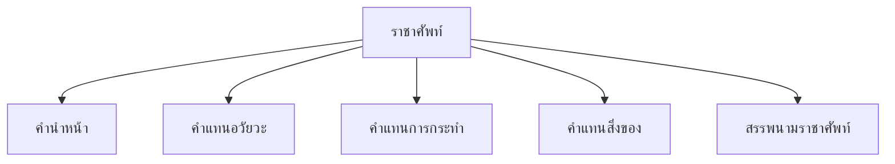

# ราชาศัพท์

> คำราชาศัพท์สำหรับพระมหากษัตริย์ พระบรมวงศานุวงศ์ พระสงฆ์ — ภาษาสำหรับเกียรติยศสูง

**ราชาศัพท์** คือ คำที่ใช้แทนคำสามัญเพื่อแสดงความเคารพต่อพระมหากษัตริย์ พระบรมวงศานุวงศ์ และพระสงฆ์ การใช้ราชาศัพท์บ่งบอกถึงมารยาทและความเคารพ

---

## เนื้อหาตามช่วงชั้น

| ช่วงชั้น | เนื้อหา |
|---|---|
| **ป.4–6** | คำราชาศัพท์พื้นฐาน |
| **ม.1–3** | ราชาศัพท์หมวดต่างๆ |
| **ม.4–6** | การใช้ในบริบท |

---

## หมวดราชาศัพท์

---

## 1. สรรพนามราชาศัพท์

| ผู้ทรง | สรรพนาม (แทนตน) | สรรพนาม (แทนผู้อื่น) |
|---|---|---|
| พระมหากษัตริย์ | กระหม่อม | ท่าน, พระองค์ |
| สมเด็จพระราชินี | กระหม่อม | ท่าน, พระองค์ |
| พระบรมวงศานุวงศ์ | กระหม่อม | ท่าน, พระองค์ |
| พระสงฆ์ | กระผม/อาตมา | ท่าน |

---

## 2. คำแทนอวัยวะ

| อวัยวะ | คำสามัญ | ราชาศัพท์ (กษัตริย์) | ราชาศัพท์ (พระสงฆ์) |
|---|---|---|---|
| หัว | หัว | พระเศียร | ศีรษะ |
| ตา | ตา | พระเนตร | เนตร |
| หู | หู | พระกรรณ | กรรณ |
| จมูก | จมูก | พระนาสิก | นาสิก |
| ปาก | ปาก | พระโอษฐ์ | โอษฐ์ |
| มือ | มือ | พระหัตถ์ | หัตถ์ |
| เท้า | เท้า | พระบาท | บาท |
| หน้า | หน้า | พระพักตร์ | พักตร์ |
| หลัง | หลัง | พระกาย | กาย |
| กาย | กาย | พระวรกาย | วรกาย |

---

## 3. คำแทนการกระทำ

| กริยา | คำสามัญ | ราชาศัพท์ (กษัตริย์) | ราชาศัพท์ (พระสงฆ์) |
|---|---|---|---|
| นอน | นอน | บรรทม | พักผ่อน |
| กิน | กิน | เสวย | ฉัน |
| ตื่นนอน | ตื่น | เสด็จ | ตื่น |
| อาบน้ำ | อาบน้ำ | สรง | สรง |
| ป่วย | ป่วย | ทรงพระปฏิพาท | อาพาธ |
| ตาย | ตาย | สวรรคต | มรณภาพ |
| ให้ | ให้ | พระราชทาน | ประทาน |
| พูด | พูด | ตรัส | กล่าว |
| มา | มา | เสด็จ | มา |
| ไป | ไป | เสด็จ | ไป |

---

## 4. คำแทนสิ่งของ

| สิ่งของ | คำสามัญ | ราชาศัพท์ |
|---|---|---|
| เสื้อผ้า | เสื้อผ้า | ฉลองพระองค์ |
| บ้าน | บ้าน | วัง/พระราชวัง |
| ที่นอน | ที่นอน | พระแท่น |
| รองเท้า | รองเท้า | ฉลองพระบาท |
| รถ | รถ | พระที่นั่ง/รถยนต์พระที่นั่ง |
| อาหาร | อาหาร | พระกระยาหาร |

---

## 5. คำนำหน้า

| คำนำหน้า | ใช้กับ |
|---|---|
| สมเด็จพระ | พระมหากษัตริย์ สมเด็จพระสังฆราช |
| พระบาทสมเด็จ | พระมหากษัตริย์ |
| พระ | พระบรมวงศานุวงศ์ พระสงฆ์ |
| หม่อม | หม่อมหรือคู่ราชสกุล |
| พระเจ้า | พระบรมวงศ์บางพระองค์ |

---

## เคล็ดลับการใช้ราชาศัพท์

1. **ใช้ให้ถูกเจ้าของ**: กษัตริย์ ≠ พระสงฆ์
2. **คำนำหน้า**: ต้องเหมาะสมกับพระองค์
3. **ไม่ผสม**: อย่าผสมราชาศัพท์กับคำสามัญ
4. **ใช้ในเอกสารทางการ**: เช่น หนังสือแสดงความน้อมถือ |

---

## ดูเพิ่มเติม

- [[15_ระดับภาษา|ระดับภาษา]]
- [[05_คำสรรพนาม|คำสรรพนาม]]
