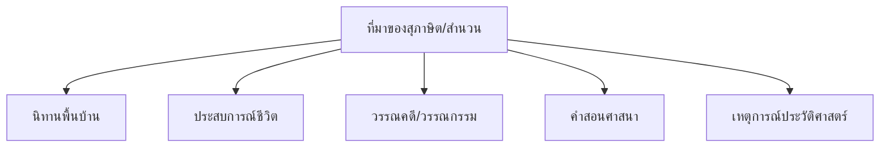

# สำนวน สุภาษิต และคำพังเพย

> ความหมาย ที่มา การใช้ในบริบทต่างๆ — ภูมิปัญญาของคนไทยที่ส่งผ่านคำพูด

**สำนวน สุภาษิต และคำพังเพย** เป็นคำพูดที่คนไทยใช้ส่งผ่านภูมิปัญญาและประสบการณ์มาแต่โบราณ เป็นส่วนสำคัญของวัฒนธรรมและภาษาไทย

---

## เนื้อหาตามช่วงชั้น

| ช่วงชั้น | เนื้อหา |
|---|---|
| **ป.4–6** | สุภาษิตง่ายๆ |
| **ม.1–3** | สำนวน สุภาษิต |
| **ม.4–6** | ที่มาและการใช้ |

---

## คำนิยาม

| คำ | ความหมาย |
|---|---|
| **สุภาษิต** | คำพูดที่มีความหมายลึกซึ้ง ใช้สั่งสอนหรือให้ข้อคิด |
| **นิทานภาษิต** | นิทานที่มีข้อคิดเป็นสุภาษิต |
| **คำพังเพย** | คำที่คนใช้พูดกันจนเป็นที่นิยม |
| **สำนวน** | การใช้คำที่มีความหมายพิเศษเป็นกลุ่ม |
| **อุปมา** | การเปรียบเทียบ |

---

## สุภาษิตไทยที่ใช้บ่อย

| สุภาษิต | ความหมาย | การใช้ |
|---|---|---|
| กินข้าวร้อนๆ | ทำสิ่งที่เพิ่งจะทำได้โดยเร็ว | แนะนำให้ทำโดยเร็ว |
| ไก่เห็นตีนกง | เห็นจากการกระทำว่าเป็นอย่างไร | บอกว่ารู้แล้วว่าจะทำอะไร |
| น้ำตกใจคอ | ทำให้ใจเย็นลง | เมื่อโกรธ ให้สงบ |
| สอนคนไม่ฉลาด | สอนแล้วไม่เรียนรู้ | เมื่อสอนแล้วไม่จำ |
| นกบนข่าย | อยู่ในสถานการณ์ยาก | เมื่อติดขัด |
| จับปลาสองมือ | ทำสองอย่างพร้อมกัน | เมื่อทำหลายอย่าง |
| เข็นครกขึ้นภูเขา | ทำสิ่งที่ยากมาก | เมื่องานยาก |
| เห็นแก่พี่น้อง | ยอมเสียประโยชน์เพื่อพี่น้อง | เมื่อยอมเสียสละ |
| ทำบุญให้ทาน | ทำความดี | แนะนำให้ทำความดี |
| รู้จักเท้าหัว | รู้จักเท้าหัวทั้งสอง | เมื่อเปรียบเทียบคน |

---

## สำนวนไทยที่ใช้บ่อย

| สำนวน | ความหมาย |
|---|---|
| หัวใจสิงห์ | มีความกล้าหาญ |
| ทองไม่รู้ร้อน | ไม่สนใจสิ่งรอบข้าง |
| น้ำใส้เหลว | อ่อนแอ ไม่มีความคิด |
| น้ำขุยน้ำ | ความเหมือนกัน |
| รู้กัน | รู้จักกันดี |
| บ้านแตก | ครอบครัวล้มเหลว |
| สีซอให้คันทาย | ทำให้เกิดปัญหา |
| ชักแม่น้ำทั้งห้า | ดึงเรื่องอื่นเข้ามา |
| คอยเหนื่อยคอยยาก | เป็นห่วงเสมอ |
| ความลับไม่มีในโลก | ความลับย่อมรู้ |

---

## ที่มาของสุภาษิตและสำนวน

---

## การใช้สุภาษิตและสำนวนในบริบท

### ตัวอย่างการใช้

**สถานการณ์:** เพื่อนอยากทำสองอย่างพร้อมกัน แต่ทำไม่ได้

> อย่า **จับปลาสองมือ** เลย ทำอย่างเดียวให้ดีก่อน

**สถานการณ์:** งานยากมาก

> นี่มันเหมือน **เข็นครกขึ้นภูเขา** เลยนะ

**สถานการณ์:** ต้องรอให้ผู้อื่นทำก่อน

> อย่าเพิ่งทำ เดี๋ยว **ไก่เห็นตีนกง** ก่อน

---

## เคล็ดลับการใช้สุภาษิตและสำนวน

1. **เข้าใจความหมาย**: อย่าใช้โดยไม่รู้ความหมาย
2. **ใช้ในบริบทที่เหมาะสม**: ต้องตรงกับสถานการณ์
3. **ใช้พอเหมาะ**: ไม่มากเกินไป
4. **รู้ที่มา**: ช่วยให้ใช้ถูกต้อง

---

## ดูเพิ่มเติม

- [[15_ระดับภาษา|ระดับภาษา]]
- [[18_ภาษากับวัฒนธรรม|ภาษากับวัฒนธรรม]]
