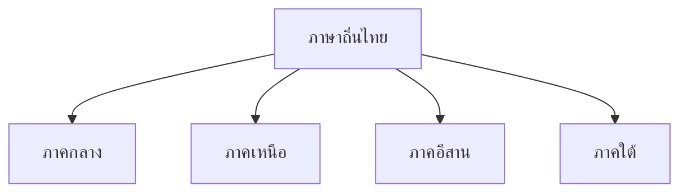
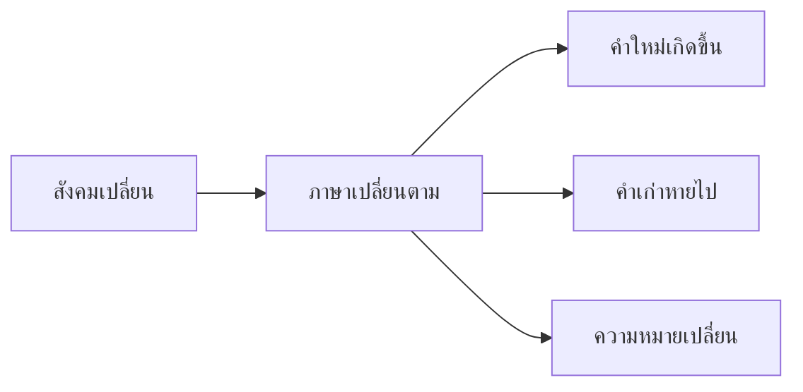

# ภาษากับวัฒนธรรม

> ภาษาถิ่นทั้ง ๔ ภาค ภาษากับสังคม การเปลี่ยนแปลงของภาษา — ภาษาสะท้อนวัฒนธรรม

**ภาษากับวัฒนธรรม** มีความสัมพันธ์กันอย่างใกล้ชิด ภาษาสะท้อนวิถีชีวิต ค่านิยม และวัฒนธรรมของผู้ใช้ การเปลี่ยนแปลงของสังคมก็ส่งผลต่อการเปลี่ยนแปลงของภาษา

---

## เนื้อหาตามช่วงชั้น

| ช่วงชั้น | เนื้อหา |
|---|---|
| **ม.1–3** | ภาษาถิ่นพื้นฐาน |
| **ม.4–6** | ภาษากับสังคม การเปลี่ยนแปลง |

---

## ภาษาถิ่นของไทย

### 1. ภาษาถิ่นภาคกลาง

| ความหมาย | คำภาษากลาง | คำถิ่นกลาง |
|---|---|---|
| สนุก | สนุก | เพลิน |
| ไม่อยาก | ไม่อยาก | เบื่อ |
| จริงจัง | จริงจัง | จริงๆ |
| น่ารัก | น่ารัก | น่าเอ็นดู |

### 2. ภาษาถิ่นภาคเหนือ

| ความหมาย | คำภาษากลาง | คำถิ่นเหนือ |
|---|---|---|
| สวย | สวย | งาม |
| เด็ก | เด็ก | น้อง |
| อร่อย | อร่อย | แซบ |
| ไม่ | ไม่ | บ่ |
| อยาก | อยาก | ต้องการ |
| สบาย | สบาย | สบายย |

### 3. ภาษาถิ่นภาคอีสาน

| ความหมาย | คำภาษากลาง | คำถิ่นอีสาน |
|---|---|---|
| อร่อย | อร่อย | แซบ |
| รัก | รัก | ฮัก |
| ไม่ได้ | ไม่ได้ | บ่ได้ |
| ไป | ไป | ไป |
| มา | มา | มา |
| เด็ก | เด็ก | ลูก |
| มาก | มาก | หลาย |

### 4. ภาษาถิ่นภาคใต้

| ความหมาย | คำภาษากลาง | คำถิ่นใต้ |
|---|---|---|
| อร่อย | อร่อย | หรอย |
| จริง | จริง | จริง |
| กิน | กิน | กิน |
| ดี | ดี | ดี |
| สวย | สวย | งาม |
| เด็ก | เด็ก | หลาน |

---

## ภาษากับสังคม

### ภาษาสะท้อนสังคม

| ภาษา | สะท้อน |
|---|---|
| ราชาศัพท์ | สังคมที่เคารพพระมหากษัตริย์ |
| ภาษาพูดกับผู้ใหญ่ | สังคมที่เคารพผู้ใหญ่ |
| ภาษาถิ่น | ความหลากหลายทางวัฒนธรรม |
| ภาษาวัยรุ่น | สังคมที่เปลี่ยนแปลงเร็ว |

---

## การเปลี่ยนแปลงของภาษา

| ปัจจัยที่ทำให้ภาษาเปลี่ยน | ตัวอย่าง |
|---|---|
| เทคโนโลยีใหม่ | คำว่า "เฟซบุ๊ก" "ไลน์" |
| วัฒนธรรมต่างชาติ | คำว่า "คาเฟ่" "ช้อปปิ้ง" |
| สื่อสังคมออนไลน์ | คำย่อ เช่น "ม33" "แง้อ้วก" |
| ค่านิยมเปลี่ยน | คำว่า "เพศ" มีความหมายกว้างขึ้น |

---

## ความสัมพันธ์ภาษา-วัฒนธรรม

1. **ภาษาสะท้อนค่านิยม**: คำสุภาพ = สังคมเคารพ
2. **ภาษาสะท้อนวิถีชีวิต**: คำเกษตร = สังคายกเกษตร
3. **ภาษาสะท้อนความเชื่อ**: คำเกี่ยวกับศาสนา = ความเชื่อ
4. **ภาษาสะท้อนประวัติศาสตร์**: คำยืมจากภาษาอื่น = ประวัติศาสตร์

---

## เคล็ดลับการใช้ภาษากับวัฒนธรรม

1. **เคารพภาษาถิ่น**: แต่ละภาคมีเอกลักษณ์
2. **รู้จักที่มา**: คำแต่ละคำมีประวัติ
3. **ตามไม่ทันเปลี่ยนแปลง**: ภาษาเปลี่ยนเร็ว ต้องติดตาม
4. **ไม่ดูถูก**: ภาษาถิ่นไม่ใช่ภาษาที่ "แย่" กว่า

---

## ดูเพิ่มเติม

- [[15_ระดับภาษา|ระดับภาษา]]
- [[17_สำนวน สุภาษิต และคำพังเพย|สำนวน สุภาษิต และคำพังเพย]]
