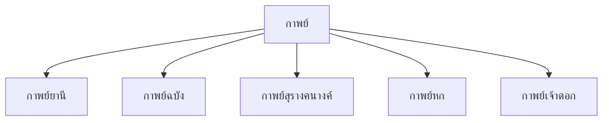

# กาพย์

> กาพย์ยานี กาพย์ฉบัง กาพย์สุรางคนางค์ — บทร้อยกรองที่มีจังหวะและสัมผัสเฉพาะ

**กาพย์** เป็นบทร้อยกรองประเภทหนึ่งของไทย มีโครงสร้างจำนวนคำและสัมผัสเฉพาะตัว กาพย์เป็นที่นิยมใช้ในวรรณคดีเรื่องต่างๆ

---

## เนื้อหาตามช่วงชั้น

| ช่วงชั้น | เนื้อหา |
|---|---|
| **ป.4–6** | บทร้อยกรองง่ายๆ |
| **ป.1–3** | กาพย์ยานี กาพย์ฉบัง |
| **ม.4–6** | กาพย์สุรางคนางค์ |

---

## ประเภทของกาพย์



---

## 1. กาพย์ยานี ๑๑

**โครงสร้าง:** ๑ บาท = ๒ วรรค (วรรคหน้า ๕ คำ, วรรคหลัง ๖ คำ)

```
วรรคหน้า: ๕ คำ
วรรคหลัง: ๖ คำ
รวม: ๑๑ คำ/บาท
```

### สัมผัสบังคับ

| ตำแหน่ง | สัมผัส |
|---|---|
| วรรคหน้า คำที่ ๓/๔ | สัมผัสกับวรรคหลัง คำที่ ๓/๔ |
| วรรคหน้า คำสุดท้าย | สัมผัสเสียงสูง-ต่ำกับวรรคหลัง |

**ตัวอย่าง:**
> อันของสูงหมายปอง (๕)
> ต้องจิตต้องพยายาม (๖)

---

## 2. กาพย์ฉบัง ๑๖

**โครงสร้าง:** ๑ บาท = ๒ วรรค (วรรคหน้า ๗ คำ, วรรคหลัง ๙ คำ)

```
วรรคหน้า: ๗ คำ
วรรคหลัง: ๙ คำ
รวม: ๑๖ คำ/บาท
```

### สัมผัสบังคับ

| ตำแหน่ง | สัมผัส |
|---|---|
| วรรคหน้า คำสุดท้าย | สัมผัสเสียงสูง-ต่ำกับวรรคหลัง |
| วรรคหน้า คำที่ ๕/๗ | สัมผัสกับวรรคหลัง |
| วรรคหลัง คำสุดท้าย | สัมผัสเสียงสูง-ต่ำกับวรรคหน้าบาทถัดไป |

---

## 3. กาพย์สุรางคนางค์ ๒๘

**โครงสร้าง:** ๑ บาท = ๒ วรรค (วรรคหน้า ๗ คำ, วรรคหลัง ๙ คำ) — เหมือนฉบัง แต่มีสัมผัสพิเศษ

```
วรรคหน้า: ๗ คำ
วรรคหลัง: ๙ คำ
รวม: ๒๘ คำ/บาท (๒ บาท = ๑ บท)
```

**ลักษณะพิเศษ:** มีสัมผัสพยัญชนะและสัมผัสสระที่ซับซ้อนกว่าฉบัง

---

## ตารางเปรียบเทียบกาพย์

| ประเภท | วรรคหน้า | วรรคหลัง | รวม/บาท |
|---|---|---|---|
| กาพย์ยานี | ๕ | ๖ | ๑๑ |
| กาพย์ฉบัง | ๗ | ๙ | ๑๖ |
| กาพย์สุรางคนางค์ | ๗ | ๙ | ๑๖ (แต่สัมผัสต่าง) |
| กาพย์หก | ๕ | ๕ | ๑๐ |

---

## ขั้นตอนการแต่งกาพย์

1. **กำหนดหัวข้อ**: เลือกเรื่องที่จะแต่ง
2. **เลือกประเภทกาพย์**: ยานี ฉบัง สุรางคนางค์
3. **นับจำนวนคำ**: ให้ถูกต้องตามโครงสร้าง
4. **เขียนวรรคแรก**: วรรคหน้าก่อน
5. **หาสัมผัส**: ตามกฎสัมผัสของกาพย์นั้นๆ
6. **ตรวจสอบ**: นับคำและตรวจสอบสัมผัส

---

## เคล็ดลับการแต่งกาพย์

1. **นับคำให้ถูก**: สำคัญที่สุด
2. **จำสัมผัส**: แต่ละประเภทมีสัมผัสต่างกัน
3. **อ่านออกเสียง**: ฟังจังหวะและความไพเราะ
4. **ฝึกแต่งบ่อยๆ**: ยิ่งฝึกยิ่งเก่ง

---

## ดูเพิ่มเติม

- [[20_กลอน|กลอน]]
- [[21_โคลง|โคลง]]
- [[การเขียน/11_การแต่งบทร้อยกรอง|การแต่งบทร้อยกรอง]]
