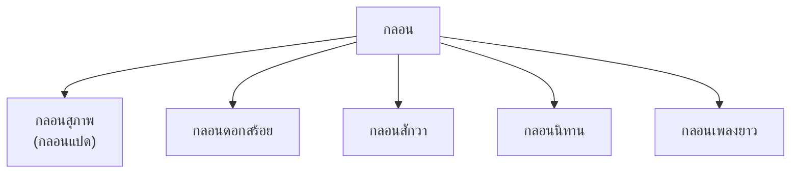
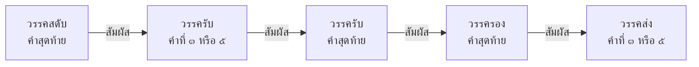

# กลอน

> กลอนสุภาพ กลอนดอกสร้อย กลอนสักวา กลอนนิทาน กลอนเพลงยาว — บทร้อยกรองที่นิยมที่สุดในไทย

**กลอน** เป็นบทร้อยกรองที่นิยมมากที่สุดในไทย มีหลายประเภท โดยเฉพาะ **กลอนสุภาพ** (กลอนแปด) ซึ่งใช้ในวรรณคดีและการประพันธ์ทั่วไป

---

## เนื้อหาตามช่วงชั้น

| ช่วงชั้น | เนื้อหา |
|---|---|
| **ป.4–6** | กลอนสุภาพเบื้องต้น |
| **ม.1–3** | กลอนสุภาพ |
| **ม.4–6** | กลอนหลากประเภท |

---

## ประเภทของกลอน

---

## 1. กลอนสุภาพ (กลอนแปด)

**โครงสร้าง:** ๑ บท = ๔ บาท

| บาท | ชื่อ | จำนวนคำ |
|---|---|---|
| ๑ | สดับ (วรรคเอก) | ๗–๘ คำ |
| ๒ | รับ (วรรคโท) | ๗–๘ คำ |
| ๓ | รอง (วรรคตรี) | ๗–๘ คำ |
| ๔ | ส่ง (วรรคจัตวา) | ๗–๘ คำ |

### สัมผัสบังคับ

**ตัวอย่างกลอนสุภาพ:**
> สวัสดีวันจันทร์เช้านี้ สดับ
> ขอให้มีความสุข รับ
> มาเรียนหนังสือเรา รอง
> ให้ได้รับความรู้ ส่ง

### การนับคำในกลอนสุภาพ

| วรรค | จำนวนคำมาตรฐาน | ยอมรับได้ |
|---|---|---|
| สดับ | ๗ คำ | ๗–๘ คำ |
| รับ | ๗ คำ | ๗–๘ คำ |
| รอง | ๗ คำ | ๗–๘ คำ |
| ส่ง | ๗ คำ | ๗–๘ คำ |

> **หมายเหตุ:** คำที่มีไม้ยมก (ๆ) และคำที่มีสระเกินมาตรฐาน (เช่น เ-ีย เ-ือ) จะถูกนับเป็น ๑ คำ

---

## 2. กลอนดอกสร้อย

**โครงสร้าง:** เหมือนกลอนสุภาพ แต่เพิ่ม "ดอกสร้อย" ท้ายวรรคสดับและวรรครอง

| ส่วน | จำนวนคำ |
|---|---|
| วรรคสดับ + ดอกสร้อย | ๗ + ๓ (ดอกสร้อย) |
| วรรครับ | ๗ |
| วรรครอง + ดอกสร้อย | ๗ + ๓ (ดอกสร้อย) |
| วรรคส่ง | ๗ |

---

## 3. กลอนสักวา

**โครงสร้าง:** เหมือนกลอนสุภาพ แต่เพิ่ม "สักวา" ท้ายวรรคสดับและวรรครอง

| ส่วน | จำนวนคำ |
|---|---|
| วรรคสดับ + สักวา | ๗ + "สักวา" |
| วรรครับ | ๗ |
| วรรครอง + สักวา | ๗ + "สักวา" |
| วรรคส่ง | ๗ |

---

## 4. กลอนนิทาน

- ใช้สำหรับเล่าเรื่อง โดยเฉพาะนิทาน
- โครงสร้างคล้ายกลอนสุภาพ แต่ไม่เคร่งครัดเรื่องสัมผัส
- มักใช้ภาษาง่ายๆ เข้าใจง่าย

---

## 5. กลอนเพลงยาว

- ใช้สำหรับเล่าเรื่องยาว
- เพิ่ม "เอย" ท้ายวรรคสดับและวรรคส่ง
- โครงสร้างคล้ายกลอนสุภาพ

---

## ตารางเปรียบเทียบกลอน

| ประเภท | โครงสร้าง | ส่วนเพิ่มพิเศษ |
|---|---|---|
| กลอนสุภาพ | ๔ บาท × ๗–๘ คำ | — |
| กลอนดอกสร้อย | กลอนสุภาพ + ดอกสร้อย | ดอกสร้อย (๓ คำ) |
| กลอนสักวa | กลอนสุภาพ + สักวa | สักวา |
| กลอนนิทาน | คล้ายสุภาพ ไม่เคร่งสัมผัส | — |
| กลอนเพลงยาว | คล้ายสุภาพ + เอย | เอย |

---

## ขั้นตอนการแต่งกลอนสุภาพ

1. **กำหนดหัวข้อ**: เลือกเรื่อง
2. **เขียนวรรคสดับ**: ๗–๘ คำ
3. **หาสัมผัส**: คำสุดท้ายของสดับ → คำที่ ๓ หรือ ๕ ของรับ
4. **เขียนวรรครับ**: ๗–Ĩ คำ สัมผัสกับสดับ
5. **เขียนวรรครอง**: ๗–๘ คำ สัมผัสกับรับ
6. **เขียนวรรคส่ง**: ๗–๘ คำ สัมผัสกับรอง
7. **ตรวจสอบ**: นับคำและสัมผัส

---

## เคล็ดลับการแต่งกลอน

1. **นับคำให้ถูก**: ๗–๘ คำต่อวรรค
2. **หาสัมผัสให้ถูกตำแหน่ง**: สดับ-รับ-รอง-ส่ง
3. **อ่านออกเสียง**: ฟังจังหวะและความไพเราะ
4. **ใช้คำที่มีความหมาย**: อย่าใช้คำเพียงเพื่อให้สัมผัส
5. **ฝึกแต่งบ่อยๆ**: ยิ่งฝึกยิ่งเก่ง

---

## ดูเพิ่มเติม

- [[19_กาพย์|กาพย์]]
- [[21_โคลง|โคลง]]
- [[การเขียน/11_การแต่งบทร้อยกรอง|การแต่งบทร้อยกรอง]]
