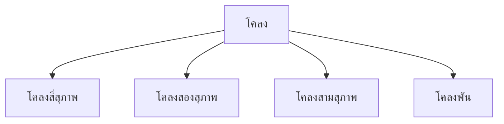

# โคลง

> โคลงสี่สุภาพ โคลงสองสุภาพ โคลงสามสุภาพ — บทร้อยกรองที่มีโครงสร้างซับซ้อนและสัมผัสเข้มข้น

**โคลง** เป็นบทร้อยกรองที่มีโครงสร้างซับซ้อน มีสัมผัสเข้มข้น โคลงสี่สุภาพเป็นประเภทที่นิยมที่สุด ใช้ในวรรณคดีสำคัญเช่น เพลงยาว ลิลิต และกาพย์

---

## เนื้อหาตามช่วงชั้น

| ช่วงชั้น | เนื้อหา |
|---|---|
| **ม.1–3** | โคลงสี่สุภาพ |
| **ม.4–6** | วิเคราะห์โคลง |

---

## ประเภทของโคลง



---

## 1. โคลงสี่สุภาพ

**โครงสร้าง:** ๑ บาท = ๒ วรรค (วรรคหน้า ๕ คำ, วรรคหลัง ๒ คำ)

```
วรรคหน้า: ๕ คำ
วรรคหลัง: ๒ คำ
รวม: ๗ คำ/บาท
๔ บาท = ๑ บท
```

### โครงสร้างโคลงสี่สุภาพ

| บาทที่ | วรรคหน้า | วรรคหลัง |
|---|---|---|
| ๑ | ๕ คำ | ๒ คำ |
| ๒ | ๕ คำ | ๒ คำ |
| ๓ | ๕ คำ | ๒ คำ |
| ๔ | ๕ คำ | ๒ คำ (ส่งด้วยเสียงจัตวา) |

### สัมผัสบังคับ

โคลงสี่สุภาพมีสัมผัสบังคับที่ซับซ้อน:

| ตำแหน่ง | สัมผัส |
|---|---|
| วรรคหน้า คำที่ ๒ | สัมผัสเสียงสูง-ต่ำกับวรรคหลังของบาทเดียวกัน |
| วรรคหน้า คำสุดท้าย | สัมผัสเสียงสูง-ต่ำกับวรรคหน้าของบาทถัดไป |
| วรรคหลัง คำสุดท้าย | สัมผัสเสียงสูง-ต่ำกับคำสุดท้ายของวรรคหน้า |
| บาทที่ ๔ วรรคหลัง | ต้องจบด้วยเสียงจัตวา |

**ตัวอย่างโคลงสี่สุภาพ:**
> ๏ เดือนสิบสองน้ำนอง (๕)
> เต็มตลิ่ง (๒)
> ฝูงปลาว่ายเวียนวิ่ง (๕)
> ไปมา (๒)
> ข้าวหลามเหนียวไข่แดง (๕)
> หวานชื่น (๒)
> สุขสันต์วันสงกรานต์ (๕)
> โอ้สา (๒)

---

## 2. โคลงสองสุภาพ

- โครงสร้างคล้ายโคลงสี่สุภาพ แต่มีเพียง ๒ บาท
- มักใช้เป็นคำอวยพรหรือคำสั้นๆ

---

## 3. โคลงสามสุภาพ

- โครงสร้างคล้ายโคลงสี่สุภาพ แต่มี ๓ บาท
- ใช้น้อยกว่าสี่สุภาพ

---

## ตารางเปรียบเทียบโคลง

| ประเภท | บาท/บท | วรรคหน้า | วรรคหลัง |
|---|---|---|---|
| โคลงสี่สุภาพ | ๔ | ๕ | ๒ |
| โคลงสองสุภาพ | ๒ | ๕ | ๒ |
| โคลงสามสุภาพ | ๓ | ๕ | ๒ |

---

## ขั้นตอนการแต่งโคลงสี่สุภาพ

1. **กำหนดหัวข้อ**: เลือกเรื่อง
2. **เขียนบาทที่ ๑**: วรรคหน้า ๕ คำ + วรรคหลัง ๒ คำ
3. **หาสัมผัส**: ตามกฎสัมผัสของโคลง
4. **เขียนบาทที่ ๒–๔**: ตามลำดับ สัมผัสเชื่อมทุกบาท
5. **บาทที่ ๔**: วรรคหลังต้องจบด้วยเสียงจัตวา
6. **ตรวจสอบ**: นับคำ ตรวจสัมผัส

---

## เคล็ดลับการแต่งโคลง

1. **นับคำให้ถูก**: ๕ + ๒ ต่อบาท
2. **จำสัมผัส**: สัมผัสเสียงสูง-ต่ำสำคัญมาก
3. **บาทสุดท้าย**: ต้องจบด้วยเสียงจัตวา
4. **อ่านออกเสียง**: ฟังจังหวะและความไพเราะ
5. **ฝึกแต่งบ่อยๆ**: โคลงเป็นฉันทลักษณ์ที่ยาก ต้องฝึก

---

## ดูเพิ่มเติม

- [[20_กลอน|กลอน]]
- [[19_กาพย์|กาพย์]]
- [[การเขียน/11_การแต่งบทร้อยกรอง|การแต่งบทร้อยกรอง]]
