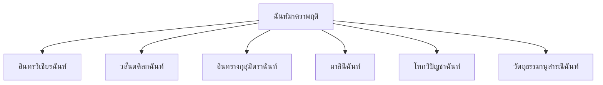

# ฉันท์

> ฉันท์มาตราพฤติ — บทร้อยกรองที่รับมาจากภาษาบาลี/สันสกฤต มีโครงสร้างพยางค์ซับซ้อน

**ฉันท์** (Chan) เป็นบทร้อยกรองที่รับมาจากฉันทลักษณ์ของภาษาบาลีและสันสกฤต โดยมีโครงสร้างที่กำหนดด้วยจำนวนพยางค์ (มาตรา) และเสียงหนัก-เบา (ครุ-ลหุ) ฉันท์เป็นฉันทลักษณ์ที่ซับซ้อนที่สุดของไทย

---

## เนื้อหาตามช่วงชั้น

| ช่วงชั้น | เนื้อหา |
|---|---|
| **ม.4–6** | ฉันท์มาตราพฤติ |

---

## แนวคิดพื้นฐานของฉันท์

### พยางค์ครุและลหุ

ฉันท์กำหนดโครงสร้างด้วยเสียงหนัก (ครุ) และเสียงเบา (ลหุ) ของพยางค์:

| ประเภท | สัญลักษณ์ | เสียง | ลักษณะ |
|---|---|---|---|
| ครุ (Heavy) | ◌ู | หนัก | สระยาว หรือมีตัวสะกด |
| ลหุ (Light) | ◌ั | เบา | สระสั้น ไม่มีตัวสะกด |

### ตัวอย่างการนับ

| คำ | สระ | ตัวสะกด | ประเภท |
|---|---|---|---|
| สวัสดี | -ั- (สั้น) | ไม่มี | ลหุ |
| สวัสดี | -ี (ยาว) | — | ครุ |
| รัก | -ั- (สั้น) | ก | ครุ |
| กิน | -ิ (สั้น) | น | ครุ |

---

## มาตราของฉันท์

ฉันท์มาตราพฤติมีหลายมาตรา แต่ละมาตรามีโครงสร้างพยางค์ครุ-ลหุ ที่แตกต่างกัน:

---

## 1. อินทรวิเชียรฉันท์

**โครงสร้าง:** ๑ บท = ๒ วรรค

| วรรค | จำนวนพยางค์ | โครงสร้าง |
|---|---|---|
| วรรคหน้า | ๘ พยางค์ | ◌ั ◌ั ◌ู ◌ู - ◌ั ◌ั ◌ู |
| วรรคหลัง | ๘ พยางค์ | ◌ั ◌ั ◌ู ◌ู - ◌ั ◌ั ◌ั ◌ู |

> (ครุ-ลหุ: ◌ั = ลหุ, ◌ู = ครุ)

### ตัวอย่าง

> สม ควร เจ้า อย่า ได้ - ทะ เลา หนัก แน่
> จง อด ทน ต่อ สู้ - อย่า ได้ ท้อ แท้

---

## 2. วสันตดิลกฉันท์

**โครงสร้าง:** ๑ บท = ๒ วรรค

| วรรค | จำนวนพยางค์ | โครงสร้าง |
|---|---|---|
| วรรคหน้า | ๘ พยางค์ | ◌ั ◌ู ◌ั ◌ู - ◌ั ◌ั ◌ั ◌ู |
| วรรคหลัง | ๘ พยางค์ | ◌ั ◌ั ◌ั ◌ู - ◌ั ◌ั ◌ั ◌ู |

---

## 3. มาลินีฉันท์

**โครงสร้าง:** ๑ บท = ๒ วรรค

| วรรค | จำนวนพยางค์ | โครงสร้าง |
|---|---|---|
| วรรคหน้า | ๑๐ พยางค์ | ◌ั ◌ู ◌ู - ◌ั ◌ั ◌ั ◌ู ◌ู - ◌ั ◌ั ◌ู |
| วรรคหลัง | ๑๐ พยางค์ | ◌ั ◌ู ◌ู - ◌ั ◌ั ◌ั ◌ู ◌ู - ◌ั ◌ั ◌ู |

---

## สัมผัสในฉันท์

นอกจากโครงสร้างครุ-ลหุ ฉันท์ยังมีสัมผัส:

| สัมผัส | รายละเอียด |
|---|---|
| สัมผัสสระ | สระของพยางค์สุดท้ายสัมผัสกัน |
| สัมผัสพยัญชนะ | พยัญชนะตัวสุดท้ายสัมผัสกัน |
| สัมผัสเสียงสูง-ต่ำ | เสียงวรรณยุกต์สัมผัสกัน |

---

## ตารางเปรียบเทียบฉันท์ที่นิยม

| ฉันท์ | วรรคหน้า | วรรคหลัง | รวม |
|---|---|---|---|
| อินทรวิเชียร | ๘ | ๘ | ๑๖ |
| วสันตดิลก | ๘ | ๘ | ๑๖ |
| มาลินี | ๑₀ | ๑₀ | ๒๐ |

---

## ขั้นตอนการแต่งฉันท์

1. **เลือกมาตรา**: อินทรวิเชียร, วสันตดิลก, ฯลฯ
2. **กำหนดหัวข้อ**: เลือกเรื่อง
3. **นับพยางค์**: ให้ถูกต้องตามมาตรา
4. **ตรวจสอบครุ-ลหุ**: สระสั้น = ลหุ, สระยาว/มีตัวสะกด = ครุ
5. **หาสัมผัส**: ตามกฎสัมผัสของฉันท์
6. **อ่านออกเสียง**: ตรวจสอบจังหวะ

---

## เคล็ดลับการแต่งฉันท์

1. **เข้าใจครุ-ลหุ**: พื้นฐานสำคัญที่สุด
2. **จำมาตรา**: แต่ละมาตรามีโครงสร้างต่างกัน
3. **นับพยางค์ให้ถูก**: ต้องตรงมาตรา
4. **อ่านออกเสียง**: ฟังจังหวะและความไพเราะ
5. **ฝึกแต่งบ่อยๆ**: ฉันท์เป็นฉันทลักษณ์ที่ยากที่สุด

---

## ดูเพิ่มเติม

- [[21_โคลง|โคลง]]
- [[23_ร่าย|ร่าย]]
- [[การเขียน/11_การแต่งบทร้อยกรอง|การแต่งบทร้อยกรอง]]
