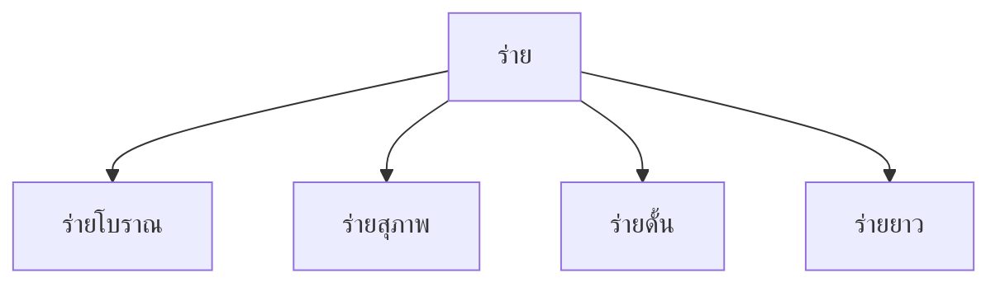

# ร่าย

> ร่ายโบราณ ร่ายสุภาพ ร่ายดั้น — บทร้อยกรองที่มีความยาวไม่จำกัด เน้นการเล่าเรื่อง

**ร่าย** (Rai) เปาะบทร้อยกรองที่มีจำนวนวรรคและบาทไม่จำกัด ใช้สำหรับเล่าเรื่องยาว มีโครงสร้างที่ยืดหยุ่นกว่ากาพย์ กลอน และโคลง

---

## เนื้อหาตามช่วงชั้น

| ช่วงชั้น | เนื้อหา |
|---|---|
| **ม.4–6** | ร่ายโบราณ ร่ายสุภาพ |

---

## ประเภทของร่าย

---

## 1. ร่ายโบราณ

**โครงสร้าง:**
- ๑ วรรค = ๕ คำขึ้นไป (ไม่จำกัด)
- ๑ บาท = ๒ วรรค
- จำนวนบาท = ไม่จำกัด

### สัมผัสบังคับ

| ตำแหน่ง | สัมผัส |
|---|---|
| วรรคหน้า คำสุดท้าย | สัมผัสเสียงสูง-ต่ำกับวรรคหลัง |
| วรรคหลัง คำสุดท้าย | สัมผัสเสียงสูง-ต่ำกับวรรคหน้าบาทถัดไป |

**ตัวอย่าง:**
> แต่ก่อนนั้นบ้านเมือง สุขสงบ
> ผาสุกทุกคน มั่งมี
> บัดนี้เกิดศัตรู มากมาย
> ต้องต่อสู้ ให้รอด

---

## 2. ร่ายสุภาพ

**โครงสร้าง:**
- ๑ วรรค = ๕–๑๐ คำ
- ๑ บาท = ๒ วรรค
- จำนวนบาท = ไม่จำกัด

### สัมผัสบังคับ

| ตำแหน่ง | สัมผัส |
|---|---|
| วรรคหน้า คำสุดท้าย | สัมผัสเสียงสูง-ต่ำกับวรรคหลัง |
| วรรคหลัง คำสุดท้าย | สัมผัสเสียงสูง-ต่ำกับวรรคหน้าบาทถัดไป |

**ลักษณะพิเศษ:**
- มี "คำสร้อย" ท้ายวรรคบางวรรค เช่น "แล้ว" "เอย" "เถิด"
- ใช้ภาษาสุภาพ ไพเราะ
- นิยมใช้ในการเล่าเรื่องราวต่างๆ

**ตัวอย่าง:**
> ในสมัยโบราณกาล โบราณ แล
> มีกษัตริย์ ทรงพระคุณอันประเสริฐ
> ทรงปกครอง บ้านเมืองให้สุขสงบ
> ประชาชน อยู่เย็นเป็นสุข ทุกคน

---

## 3. ร่ายดั้น

**โครงสร้าง:**
- โครงสร้างคล้ายร่ายสุภาพ
- แต่ "ดั้น" แปลว่า ค้นหา/แสวงหา
- เน้นการใช้คำซ้อน คำประสม คำสนธิ-สมาส

**ลักษณะพิเศษ:**
- ใช้ภาษาที่ซับซ้อน คำยืมจากบาลี/สันสกฤต
- เน้นความหมายลึกซึ้ง
- นิยมในวรรณคดีเช่น ลิลิตเงินไ

---

## ตารางเปรียบเทียบร่าย

| ประเภท | คำ/วรรค | สัมผัส | คำสร้อย | ลักษณะ |
|---|---|---|---|---|
| ร่ายโบราณ | ๕+ | เสียงสูง-ต่ำ | ไม่มี | เรียบง่าย |
| ร่ายสุภาพ | ๕–๑๐ | เสียงสูง-ต่ำ | มี | ไพเราะ สุภาพ |
| ร่ายดั้น | ๕–๑๐ | เสียงสูง-ต่ำ | มี | ซับซ้อน ลึกซึ้ง |

---

## ลักษณะเฉพาะของร่าย

1. **ความยาวไม่จำกัด**: สามารถเล่าเรื่องยาวได้
2. **โครงสร้างยืดหยุ่น**: จำนวนคำต่อวรรคไม่ตายตัว
3. **สัมผัสน้อยกว่า**: เทียบกับกลอน/โคลง/ฉันท์
4. **เหมาะกับการเล่าเรื่อง**: ใช้ในวรรณคดีเรื่องยาว

---

## วรรณคดีที่ใช้ร่าย

| วรรณคดี | ประเภทร่าย |
|---|---|
| ลิลิตยุคนางกลัง | ร่ายโบราณ |
| ลิลิตโอดการแต่ง | ร่ายสุภาพ |
| ลิลิตเงินไ | ร่ายดั้น |
| ลิลิตพระลอ | ร่ายสุภาพ |

---

## ขั้นตอนการแต่งร่าย

1. **กำหนดเรื่อง**: ร่ายเหมาะกับเล่าเรื่องยาว
2. **เลือกประเภ**: โบราณ/สุภาพ/ดั้น
3. **เขียนวรรคแรก**: ๕–๑๐ คำ
4. **หาสัมผัส**: คำสุดท้ายสัมผัสเสียงสูง-ต่ำกับวรรคหลัง
5. **เพิ่มคำสร้อย**: ถ้าเป็นร่ายสุภาพ (เอย, แล้ว, เถิด)
6. **เขียนต่อเนื่อง**: บาทต่อไปจนจบเรื่อง

---

## เคล็ดลับการแต่งร่าย

1. **เล่าเรื่องเป็นลำดับ**: ต้น-กลาง-ท้าย
2. **ใช้สัมผัสเสียงสูง-ต่ำ**: เชื่อมวรรคและบาท
3. **ใช้คำสร้อย**: เพื่อความไพเราะ (แล้ว, เอย, เถิด)
4. **ระดับภาษา**: โบราณ = ง่าย, สุภาพ = ไพเราะ, ดั้น = ลึกซึ้ง
5. **อ่านออกเสียง**: ฟังจังหวะเล่าเรื่อง

---

## ดูเพิ่มเติม

- [[22_ฉันท์|ฉันท์]]
- [[21_โคลง|โคลง]]
- [[การเขียน/11_การแต่งบทร้อยกรอง|การแต่งบทร้อยกรอง]]
